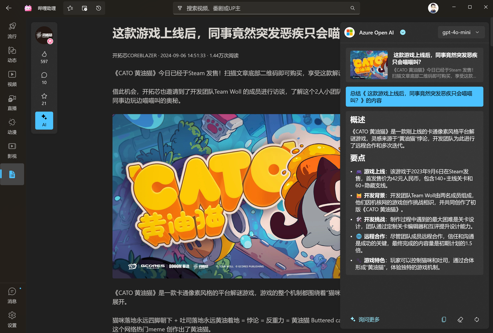

<p align="center">

</p>

<div align="center">

# 哔哩助理 (SponsorBlock Edition)

[](https://www.gnu.org/licenses/gpl-3.0)
[](https://github.com/Richasy/Bili.Copilot)

`哔哩助理` 是 [哔哩哔哩](https://www.bilibili.com) 的第三方桌面应用，适用于 Windows 11.

**本版本**基于 [Richasy/Bili.Copilot](https://github.com/Richasy/Bili.Copilot) 修改，新增 **SponsorBlock 自动跳过广告/赞助片段** 功能。

> **许可证：** [GPL-3.0](LICENSE) | **原项目：** [Richasy/Bili.Copilot](https://github.com/Richasy/Bili.Copilot) (GPL-3.0)

</div>
<p align="center">
<a href="#概述">概述</a> &nbsp;&bull;&nbsp;
<a href="#本版新增">🆕 本版新增</a> &nbsp;&bull;&nbsp;
<a href="#安装">安装</a> &nbsp;&bull;&nbsp;
<a href="#开发">开发</a> &nbsp;&bull;&nbsp;
<a href="#使用">使用</a> &nbsp;&bull;&nbsp;
<a href="#鸣谢">鸣谢</a>
</p>

## 概述

哔哩助理在 [哔哩](https://github.com/Richasy/Bili.Uwp) 的基础上通过 Windows App SDK 进行了重构.

> ⚠️ **本项目为 [Richasy/Bili.Copilot](https://github.com/Richasy/Bili.Copilot) 的修改版本，原版权归属 Richasy 及 BiliCopilot Contributors。**

## 🆕 本版新增

### SponsorBlock 自动跳过

参考 [SponsorBlock](https://sponsor.ajay.app/) 项目，为哔哩助理集成了自动跳过视频中的广告、赞助、自我推广等片段的功能：

- **自动跳过赞助/广告片段** — 播放时自动识别并跳过已标记的片段
- **社区数据库驱动** — 使用 [bsbsb.top](https://www.bsbsb.top) 社区维护的片段标记
- **可配置开关** — 设置页可开启/关闭 SponsorBlock 和自动跳过功能
- **跳过提示条** — 跳过时显示动画提示，告知用户跳过的内容类型
- **FIFO 缓存机制** — 智能缓存已查询的片段信息，减少网络请求

#### 新增/修改的文件

| 文件 | 说明 |
|------|------|
| `Models/SponsorModels.cs` | SponsorBlock 数据模型定义（Segment、Category 等） |
| `Services/SponsorBlockService.cs` | HTTP 客户端 + FIFO 缓存服务 |
| `Services/ISponsorBlockService.cs` | 服务接口 |
| `ViewModels/Core/PlayerViewModel/PlayerViewModel.SponsorBlock.cs` | 播放器集成逻辑（加载/检查/跳过） |
| `Controls/Settings/SponsorBlockSettingControl.xaml/.cs` | 设置页 UI 控件 |
| `Pages/SettingsPage.xaml` | 设置页中嵌入 SponsorBlock 开关 |
| `Controls/Player/PlayerOverlay.xaml` | 跳过提示条 UI + 动画 |

#### 修复的问题

| 问题 | 修复 |
|------|------|
| 视频无法播放（缺 libmpv） | 移除 csproj 中对 libmpv-2.dll 的 Content Remove 排除规则 |
| AOT 编译崩溃（COM 错误） | 禁用 PublishAot |
| 设置页鬼畜滚动 | 移除 RepositionThemeTransition，添加 VerticalAlignment=Top |

## 安装

### 下载 Release（推荐）

1. 前往 [Releases](../../releases) 页面
2. 下载最新版本的 `BiliCopilot.UI_1.0.1.0_x64.msix`（约 140 MB）
3. 双击安装，或右键 → 安装
4. 首次运行需开启 **开发人员模式**：设置 → 系统 → 开发者选项 → 开发人员模式

> ⚠️ MSIX 包使用自签名证书，首次安装可能需要手动信任证书。

### 商店版本（原版）

### 侧加载

1. 打开系统设置，依次选择 `系统` -> `开发者选项`，打开 `开发人员模式`。滚动到页面底部，展开 `PowerShell` 区块，开启 `更改执行策略...` 选项
2. 打开 [Release](https://github.com/Richasy/Bili.Copilot/releases) 页面
3. 在最新版本的 **Assets** 中找到应用包下载。命名格式为：`BiliCopilot_{version}_{platform}.zip`
4. 下载应用包后解压，右键单击文件夹中的 `install.ps1` 脚本，选择 `使用 PowerShell 运行`

## 开发

在开发哔哩助理的过程中，抽离出了多个单独组件，可以被其它开发者集成到自己的项目中：

- [bili-kernel](https://github.com/Richasy/bili-kernel)  
  哔哩助理与 BiliBili API 交互的核心代码，是一层 .NET 包装器，基于 .NET Standard 2.0，完全的 AOT 支持，便于移植和二次开发。
- [agent-kernel](https://github.com/Richasy/agent-kernel)  
  小幻助理 / 小幻阅读 / 哔哩助理 共享的 AI 基础库，支持 20 余种 AI 服务，并提供完全的 AOT 支持。
- [mpv-kernel](https://github.com/Richasy/mpv-kernel)  
  哔哩助理的核心播放器之一，将 MPV 集成进 WinUI3 以实现良好的播放体验。
- [winui-kernel](https://github.com/Richasy/winui-kernel)  
  我在多个 WinAppSDK 项目之间共用的一些基础样式及实现。

它们都以 nuget 形式集成在项目内

第一次克隆时可以运行下面的命令：

```shell
git clone https://github.com/<YOUR_USERNAME>/BiliCopilot-SponsorBlock.git
```

切换分支完成后，还需要下载 mpv / ffmpeg 到对应的目录：

| 文件名       | 目录                                                     | 说明                                                                                                                                                                         |
| ------------ | -------------------------------------------------------- | ---------------------------------------------------------------------------------------------------------------------------------------------------------------------------- |
| libmpv-2.dll | src\Desktop\BiliCopilot.UI\Assets\libmpv\x64(或者 arm64) | 可以在 [mpv-winbuild](https://github.com/zhongfly/mpv-winbuild) 下载最新的 dev 构建（x64 对应 x86_x64，arm64 对应 aarch64），把 libmpv-2.dll 放入对应文件夹中，用以 mpv 播放 |
| ffmpeg.exe   | src\Desktop\BiliCopilot.UI\Assets\ffmpeg                 | 可以在 [mpv-winbuild](https://github.com/zhongfly/mpv-winbuild) 下载最新 ffmpeg x64 构建，将 ffmpeg.exe 放入对应文件夹中，用于视频下载后的混流                               |

## 使用

### 登录

哔哩助理优先使用扫码登录，如果你偏好其它的登录方式（比如手机/用户名密码），你可以选择网页登录。

### 视频播放

新版本的哔哩助理（V2）支持两种种播放方案：

1. MPV
2. 外部播放器（仅支持 MPV）

下面是几种播放方案的具体比较，请根据自己的情况选择合适的播放方案：

| 方案       | 优点                               | 缺点                       |
| ---------- | ---------------------------------- | -------------------------- |
| MPV        | 解码速度快，播放稳定               | 内存占用相对较高           |
| 外部播放器 | 自定义程度高，可以获得最佳播放体验 | 需要额外安装配置，门槛较高 |

### 人工智能

哔哩助理与 [小幻助理](https://github.com/Richasy/Rodel.Agent) 共享代码，接入 20 余种国内外主流 AI 模型服务，给用户足够多的选择。

你可以通过大语言模型对视频/文章内容进行总结（视频需要有字幕），或者结合内容与评论对视频/文章进行 AI 评价。

或许更进一步，你可以基于当前视频/文章的内容与模型对话，针对性地回答你的疑问。

开发者会持续探索大语言模型和 B 站内容结合的边界，更进一步挖掘 AI 潜力，也欢迎你提出你的想法，真正让 AI 有用起来。

## 视频下载

新版本的哔哩助理（V2）内置了 [BBDown](https://github.com/nilaoda/BBDown) 作为下载工具，也内置了 ffmpeg 作为混流工具，用户无需额外下载依赖，在视频播放下面点击下载按钮即可按需下载。

> [!WARNING]
> 目前 ffmpeg 仅内置了 x64 版本，如果你的设备是 Windows 10 ARM64，那么将无法使用内置的下载器。如果设备是 Windows 11，那么可以正常使用 X64 的 ffmpeg。

### 调用外部下载器

部分同学可能有自己配置好的 BBDown，那么可以在设置页面的下载设置中打开 `下载时调用外部BBDown`。你还可以选择在下载时仅复制下载命令，以便进行二次编辑。

## 交流讨论

有兴趣一起交流的话，可以加 QQ 群，进群请注明正在使用哪款软件。


## 应用截图




## 鸣谢

- **[Richasy](https://github.com/Richasy)** — 哔哩助理 (BiliCopilot) 原作者，本项目的所有基础代码均来自其开源贡献
- [Windows App SDK](https://github.com/microsoft/windowsappsdk)
- [WinUI](https://github.com/microsoft/microsoft-ui-xaml)
- [BiliBili](https://www.bilibili.com/)
- [哔哩哔哩-API 收集整理](https://github.com/SocialSisterYi/bilibili-API-collect)
- [BBDown](https://github.com/nilaoda/BBDown)
- [BewlyBewly](https://github.com/BewlyBewly/BewlyBewly)
- [寒霜弹幕使](https://github.com/cotaku/DanmakuFrostMaster)
- [cnbluefire/WinUI3.Win2D](https://github.com/cnbluefire/WinUI3.Win2D)
- [Windows Community Toolkit](https://github.com/CommunityToolkit/Windows)
- [FluentIcons](https://github.com/davidxuang/FluentIcons)
- [ComputeSharp](https://github.com/Sergio0694/ComputeSharp)
- 以及其他在开发过程中提供过助力的小伙伴
